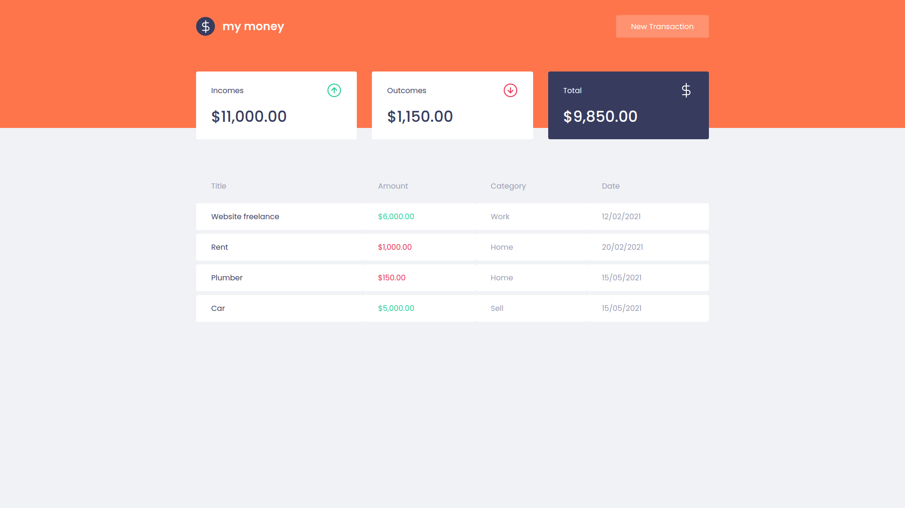

<p align="center">
    
</p>

<h2 align="center">
    A cool way to save your finances.
</h2>

## Layout



## Usage
To build this app you'll need [Node.js](https://nodejs.org).
```
$ git clone https://github.com/Eduardo-H/my-money
$ cd mymoney
$ yarn install
$ yarn start
```

## More about the project
This project was created in an online bootcamp focused on learning more than just React, but learn about how to become a real front end developer.